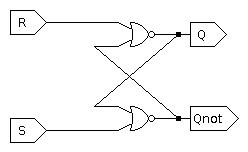

# General Questions

1. Consider the Boolean expression
```
A'B'C' + A'BC' + A'B'C + AB'C
```
Simplify this expression using a K-map.
You may check your work using Boolean algebra,
but you will need to know how to draw and circle a K-map for the exam.

2. Describe in your own words the fundamental difference between combinational
circuits and sequential circuits.

3. What relatively simple test can we perform to determine whether a circuit
is combinational?

4. Is the following circuit combinational or sequential?


5. Is the following circuit combinational or sequential?


6. Why is it not possible to represent sequential circuits using truth tables?

7. For each of the following applications,
determine whether it could be modeled by a combinational circuit
or whether a sequential circuit would be required and explain *why*.
* Each day, a student enters the number of pages they have read that day.
  The circuit then outputs the total number of pages the student has read that
  semester.
* A customer enters all of the toppings that will go on a pizza and the circuit
  outputs the price of the pizza.
* Each time a user makes a credit card transaction or payment,
  the circuit outputs the current balance of the credit card.

7. Can all sequential circuits be described with Boolean algebra?
If not, can you come up with an example of why this does not work?

8. Why must an SR latch be analyzed until it converges,
which may take several iterations through the circuit,
whereas an adder does not need to be analyzed through multiple iterations?

9. Create a characteristic table for the circuit below.
(Hint: the circuit has just one input, but has two bits of state.)


10. When filling out the characteristic table for the SR latch in lecture,
we assumed that the outputs `Q` and `Qnot` always started as opposites.
How can we force the circuit into a state where that is not the case?

11. Consider the two diagrams below.
The first is the standard SR latch.
The second is wired the same, but with the `Qnot` output removed.
Will the circuit in the second diagram behave the same as the circuit in the
first diagram?




12. Consider the diagram below.
Is the circuit in this diagram an SR latch?
That is, if we treated it as a black box and considered only its inputs and
outputs,
would it behave the same way as the circuit we have been studying?
(Hint: how can we characterize the behavior of a sequential circuit?)


13. The output of a D latch is currently 0.
Describe what must be done to make the output 1.

14. Assume the input to a latch is controlled by combinational logic that takes
40 ns to reach a steady state from when its own inputs are updated.
During that time, its output(s) may glitch.
Why is this a problem for an SR latch?
How can a D latch handle this problem?

15. Design a timing diagram
(a view of the input `D` and the clock over time)
for which a D latch and a D flip-flop behave very differently.

16. Create a circuit that stores one bit of state and takes one input.
At the rising edge of the clock, this circuit will
* flip its stored bit if the input is `0`
* keep its stored bit if the input is `1`

You may use a D flip-flop and/or D latch as a black box.
