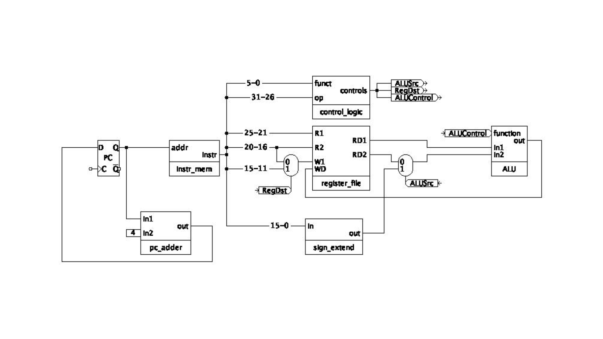

# General Questions

1. Explain, in general terms,
why or how a single circuit is able to handle different instruction types.
Or, put another way,
if you were asked to add circuitry for a new instruction type,
how would you go about it in general?

2. Consider the datapath we implemented for R-type and (some) I-type
instructions, pictured below.



What are the values of `RegDst` and `ALUSrc` when the instruction is `addi`?

3. In the datapath above,
write in the values on as many of the wires as possible for the instruction
`addi $14, $15, 8`.
What additional information would you need to completely fill out the diagram?

4. Explain the purpose of the wire above with bits `15-11`.
Which instructions ignore this wire?

5. We will learn how to build the control logic later.
Do you expect that the control logic will implemented with a combinational or a
sequential circuit?
Why?

For the next few questions, consider the following code snippet:
```
    addi $t0, $0, 2
    addi $t1, $0, 4
    addi $s0, $0, 0

    sll $t2, $t0, 1
    beq $t1, $t2, L1
    addi $s0, $s0, 8

L1:
    beq $t0, $t1, L2
    addi $s0, $s0, 4

L2:
    addi $s0, $s0, 2
```

6. What is the value in `$s0` when the code finishes?

7. Write high-level code that corresponds to the assembly code above.

8. What are the values of the immediates stored in the two branch
instructions?

9. Write the machine code for the branch instructions above.

10. You are designing a new MIPS-like 32-bit architecture.
However, you want your architecture to have 64 registers.
Design an R-type instruction for this architecture.
What decisions/compromises do you need to make in your design?

11. Why does a jump instruction need to store the address in a "funny" way?
Why not just encode the entire address in the instruction?

12. What is the value of the immediate stored in the jump instruction in the
following code snippet?
```
0x00400000 |       j place
0x00400004 |       addi $t0, $0, 1
0x00400008 |       addi $t1, $0, 2
0x0040000C |       and $t2, $t0, $t1
0x00400010 | place: or $t3, $t0, $t1
0x00400014 |       xor $t4, $t0, $t1
```

13. Why can a jump move farther than a branch?

14. Write the following in assembly.
```python
x = 8
if x < 10:
    y = 5
else:
    y = 6
```

15. Write the following in assembly.
```python
x = 8
if x < 2*x:
    y = 5
else:
    y = 6
```

16. Write the following in assembly.
```python
x = 8
y = 0
while x > 1:
    y = y + x
    x = x/2
```
