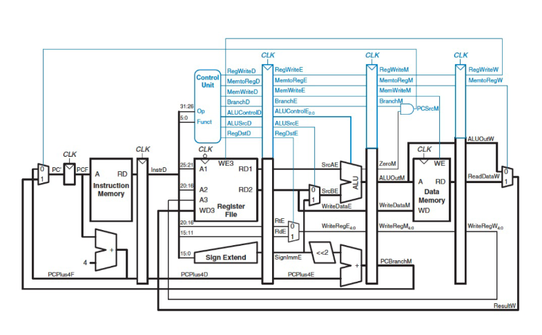

# General Questions

1. Work through the questions in the
   [caches and block size handout](/handouts/block-cache-handout.pdf)

2. Which of the following code snippets would most likely benefit most from
   the presence of a cache?
   Why?

   ```python
   total = 0
   for i in range(100):  # for (int i = 0; i < 100; i++)
       total += 5
   ```

   ```python
   total = 0
   for i in range(100):
       total += array[i]
   ```

   ```python
   total = 0
   for j in range(25):
       for i in range(4):
           total += array[i]
   ```

3. Give an example of code (assembly or high-level) where spatial locality
   applies,
   but temporal locality does not (or does not much).

4. Give an example of code (assembly or high-level) where temporal locality
   applies,
   but spatial locality does not (or does not much).

5. Consider the following sequence of cache hits and misses.
   What is the average memory access time assuming a cache access costs 1 ns
   and a memory access costs 500 ns?
   What would the average memory access time be without a cache?

   H, M, M, M, H, H, H, H, H, H

6. Is it ever possible for memory and cache to be out of sync
   (i.e., the contents of memory are different from the corresponding cache
   entries)?
   If so, how can this happen?
   If not, why not?

7. Try the not-for-credit cache activities posted to PL.
   Repeat them a few times until you are comfortable.

8. Consider wrapping Christmas presents with two friends.
   To wrap a present,
   you need to cut the paper to the correct size,
   fold it around the present,
   and then tape the paper on.

   If you have many presents to wrap but only one pair of scissors and one
   piece of tape,
   explain the three of you could work together to get the presents wrapped
   faster.

9. In the above scenario,
   would you be able to wrap presents three times as quickly as one of you
   could individually?
   Why or why not?

10. Assuming it takes 10 seconds to cut, 30 seconds to wrap, and 5 seconds to
    tape,
    how long will it take you to wrap 1 present?
    5 presents?
    (For this question,
    assume the time to hand the present from one person to the next can be
    ignored.)

11. Consider the same scenario,
    except you have three pairs of scissors,
    three rolls of paper,
    and three tape holders.
    How would this change your answers to any of the previous questions,
    if at all?

12. Come up with a real-life example of pipelining that you might see
    (it doesn't need to be anything practical,
    though you might be surprised how often the idea can come up).
    Discuss with your groupmates and explain why it is a pipeline,
    how well it would increase throughput,
    and so on.



13. The processor above is split into five stages.
    Ideally, how would this change
    * the latency?
    * the throughput?

    In practice, give one or two reasons why the throughput will not be improved 
    by the ideal amount.

14. Imagine if the control signals were not pipelined along with the rest of
    the instruction.
    Instead, whatever is currently in the decode stage determines the control
    signals throughout the ciruit.
    What could go wrong if you have an `add` instruction in the Memory stage
    and a `sw` instruction in the Decode stage?
    
15. Consider the same scenario,
    but you now have an `add` instruction in the Execute stage
    and an `addi` instruction in the Decode stage?
    


16. Consider the image above.
    Explain what is happening in the Execute stage of the pipeline during
    cycle 5.
    For example, which instruction is in that stage,
    what are the operands to the ALU,
    how are the control wires set,
    and so on.

17. During cycle 6 of the above image,
    what is happening in the Fetch stage?

18. The pipelined MIPS process we learned about in lecture has 5 stages.
    If we added a 6th stage,
    would throughput be improved?
    Why or why not?
    What about latency?

19. With a five-stage pipeline,
    how many instructions will the processor complete in the first 8 cycles?

20. With a five-stage pipeline and a clock cycle of 200 ps,
     what is the long-term throughput of the processor?

21. According to the textbook,
    the Fetch and Memory stages are the slowest stages of the pipeline.
    If we were to slow down the ALU slightly,
    would this affect the throughput of the processor?
    Why or why not?
