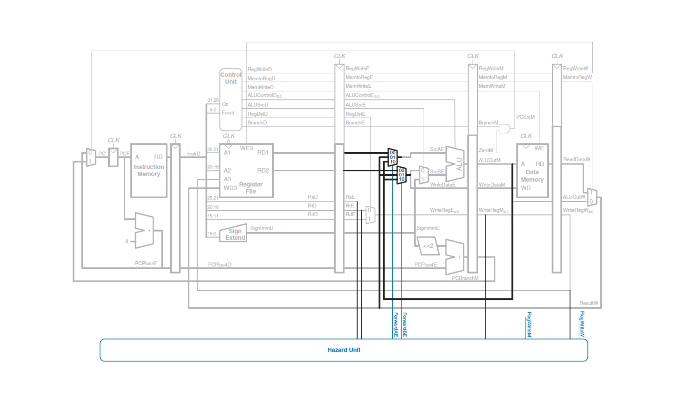

# General Questions

For all questions below involving code,
assume the code is run on the five-stage MIPS pipeline as described in lecture.
There is an image of the pipeline partway through the activities that you can
use for reference if needed.

1. Identify any data hazards in the code below.
   Determine whether any hazards you find can be solved via forwarding.
   ```
   add $t0 $t1 $t2
   add $t1 $t2 $t3
   add $s0 $t0 $t3
   ```

2. Consider the two code snippets below.
   Assume they are run independently of one another.
   For each snippet,
   determine whether it would require a stall to operate correctly and explain
   why or why not.
   ```
   # A
   sub $s0 $s3 $t0
   add $t1 $s0 $s0
   and $s2 $t1 $t1
   ```

   ```
   # B
   ori $t7 $0 15
   lw $t6 1($t7)
   addi $s4 $t6 $t7
   ```

3. Give the values stored in `$t0`, `$t1`, and `$t2` at the end of the
   following code snippet assuming
   * the code is run on a processor that correctly implements data forwarding.
   * the code is run on a processor that does not implement data forwarding.

   Why do you think I added the `addu` statements to the end?
   ```
   # $t0 holds the value 50
   # $t1 holds the value 40
   addi $t0 $t0 1
   addi $t1 $t0 1
   slt $t2 $t0 $t1
   addu $0 $0 $0
   addu $0 $0 $0
   addu $0 $0 $0
   addu $0 $0 $0
   ```

4. The code below contains a data hazard that will result in a stall.
   Identify the hazard.
   Which instructions will end up spending more than 5 cycles in the pipeline
   due to the stall?
   ```
   # $t0 holds the value 50
   # $t1 holds the value 40
   add $t0 $t0 $t2
   lw $t1 4($t0)
   slt $t2 $t0 $t1
   or $s1 $s2 $s3
   and $s4 $s6 $s5
   slti $s4 $s4 0
   # ... code continues
   ```

5. Draw a pipeline diagram
   (the one that runs in a stair-step pattern with cycles along the horizontal
   axis and instructions along the vertical axis)
   showing how the previous instructions go through the pipeline.
   When data forwarding occurs,
   indicate it by drawing an arrow showing where the information is forwarded
   from and to.
   (Hint: the arrows should always be vertical.)



6. The third instruction below needs to have one of its operands forwarded
   from a previous instruction.
   In the image above,
   highlight the part of the data path showing how the forwarding happens for
   that particular instruction.
   ```
   add $t0 $t1 $t2
   add $s0 $s1 $s2
   add $t0 $t0 $t2
   ```

7. For each instruction below,
   determine where the operands to the ALU will come from during that
   instruction's Execute stage
   (i.e., determine `ForwardAE` and `ForwardBE` in the diagram above).
   ```
   add $t0 $t1 $t2
   slt $t2 $t0 $t1
   or $s1 $s2 $t0
   and $s4 $s6 $t0
   lw $t1 4($s4)
   slti $s6 $t1 0
   ```
